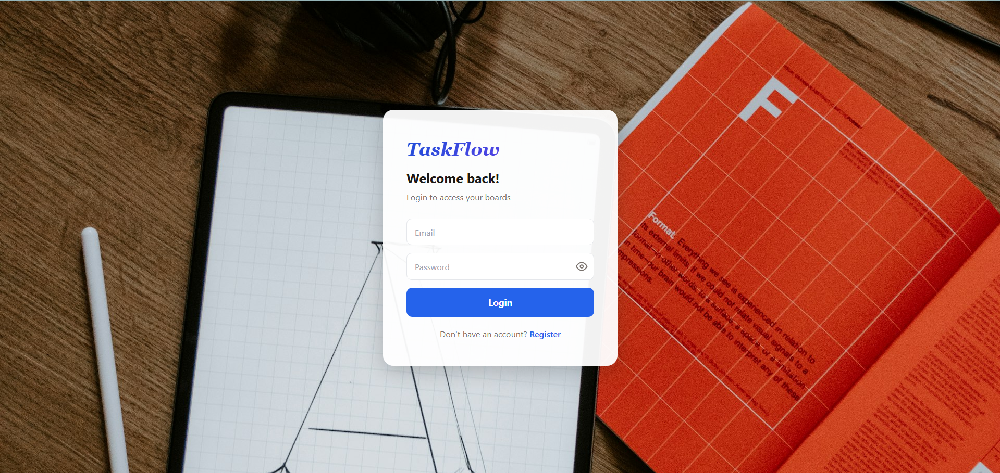
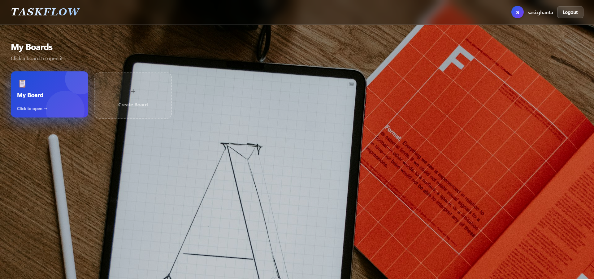
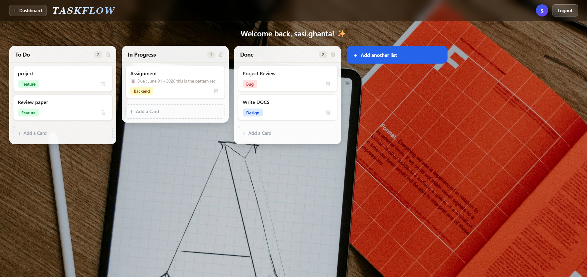

# 🗂️ TaskFlow — Full Stack Project

A modern full-stack Trello-inspired task management application built using React, Node.js, Express.js, and PostgreSQL with smooth drag-and-drop functionality.

🔗 **Live App:** [trello-tau-amber.vercel.app](https://trello-tau-amber.vercel.app)  
🔗 **Backend API:** [trello-backend-i0lq.onrender.com](https://trello-backend-i0lq.onrender.com)
📁 **GitHub:** [github.com/sasighanta/trello](https://github.com/sasighanta/trello)

## 📸 Screenshots

### Login Page


### Dashboard


### Board View


---

## ✨ Features

### 🔐 Authentication
- User Login & Register
- Session-based per-user experience
- Personalized dashboard per account

### 🏠 Dashboard
- Board overview after login
- `Login → Dashboard → Board` flow
- Create Board placeholder for future expansion

### 🗂️ Board & Task Management
- Create, rename (double-click), and delete lists
- Create, edit (title + description), and delete cards
- Description preview shown directly on card
- Color-coded tags — Design, Feature, Backend, Bug

### 🔄 Drag & Drop
- Smooth drag-and-drop card movement
- Move cards across lists
- Persistent ordering saved to database

### 🎨 UI/UX
- Hover-based trash icons (no cluttered delete buttons)
- Dashed interactive "Add" buttons
- Cards lift on hover with smooth transitions
- Toast notifications for every action
- Empty state UI with icon
- Avatar initial in header
- Scrollable columns for long lists
- Pencil icon hint on editable titles

---

## 🛠️ Tech Stack

| Layer | Technology |
|-------|-----------|
| Frontend | React, Vite, Axios, @hello-pangea/dnd, react-hot-toast |
| Backend | Node.js, Express.js |
| Database | PostgreSQL (Supabase) |
| Hosting | Vercel (frontend), Render (backend), Supabase (database) |

---

## 📂 Project Structure

```
trello/
├── frontend/
│   └── src/
│       ├── App.jsx
│       ├── Auth.jsx
│       ├── Dashboard.jsx
│       └── components.jsx
│
├── backend/
│   ├── routes.js
│   ├── db.js
│   └── index.js
│
└── README.md
```

---

## ⚙️ Installation & Setup

### 1️⃣ Clone Repository
```bash
git clone https://github.com/sasighanta/trello.git
```

### 2️⃣ Backend Setup
```bash
cd trello/backend
npm install
```

Create a `.env` file:
```env
DATABASE_URL=your_postgresql_connection_string
PORT=5000
```

Run the server:
```bash
node index.js
```

### 3️⃣ Frontend Setup
```bash
cd trello/frontend
npm install
npm run dev
```

Frontend runs on `http://localhost:5173`

---

## 🗄️ Database Schema

```sql
CREATE TABLE users (
  id SERIAL PRIMARY KEY,
  username VARCHAR(100) UNIQUE NOT NULL,
  password TEXT NOT NULL
);

CREATE TABLE boards (
  id SERIAL PRIMARY KEY,
  user_id INTEGER REFERENCES users(id),
  title TEXT
);

CREATE TABLE lists (
  id SERIAL PRIMARY KEY,
  board_id INTEGER REFERENCES boards(id),
  title TEXT,
  position INTEGER
);

CREATE TABLE cards (
  id SERIAL PRIMARY KEY,
  list_id INTEGER REFERENCES lists(id),
  title TEXT,
  description TEXT,
  tag VARCHAR(50),
  tag_label VARCHAR(50),
  position INTEGER
);
```

---

## 📡 API Endpoints

| Method | Endpoint | Description |
|--------|----------|-------------|
| POST | `/api/auth/register` | Register a new user |
| POST | `/api/auth/login` | Login and get token |
| GET | `/api/user/:userId/board` | Fetch full board with lists and cards |
| POST | `/api/lists` | Create a new list |
| PUT | `/api/lists/:id` | Update list title |
| DELETE | `/api/lists/:id` | Delete list and its cards |
| POST | `/api/cards` | Create a new card |
| PUT | `/api/cards/:id/title` | Update card title |
| PUT | `/api/cards/:id/description` | Update card description |
| PUT | `/api/cards/reorder` | Reorder cards after drag and drop |
| DELETE | `/api/cards/:id` | Delete a card |

---

## 🚀 Future Improvements
- Multiple boards per user
- Due dates on cards
- Team collaboration
- Activity history
- Dark mode
- Labels and priorities
- Search and filters

---

## 👨‍💻 Author

**Sasi Sai Tulasi Ghanta**  
[GitHub](https://github.com/sasighanta) • [LinkedIn](https://linkedin.com/in/sasighanta)

---

## ⭐ Conclusion

This project demonstrates full-stack development skills including REST APIs, database integration, authentication, drag-and-drop functionality, deployment, and responsive UI/UX. Built as a placement-focused project to showcase modern web development practices.

---

## 📄 License

This project is open source and available under the [MIT License](LICENSE).
