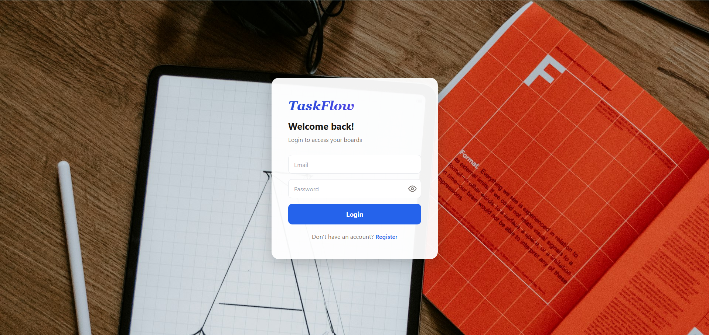
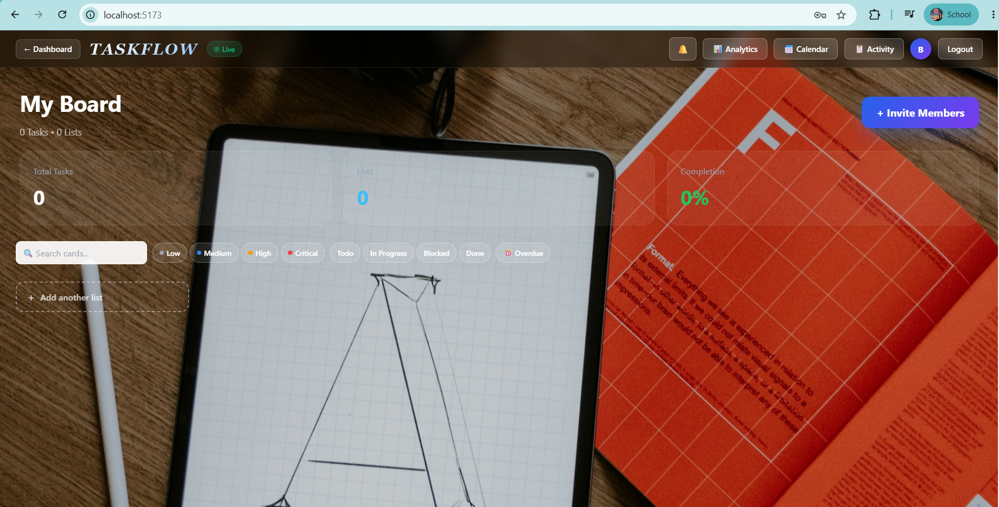
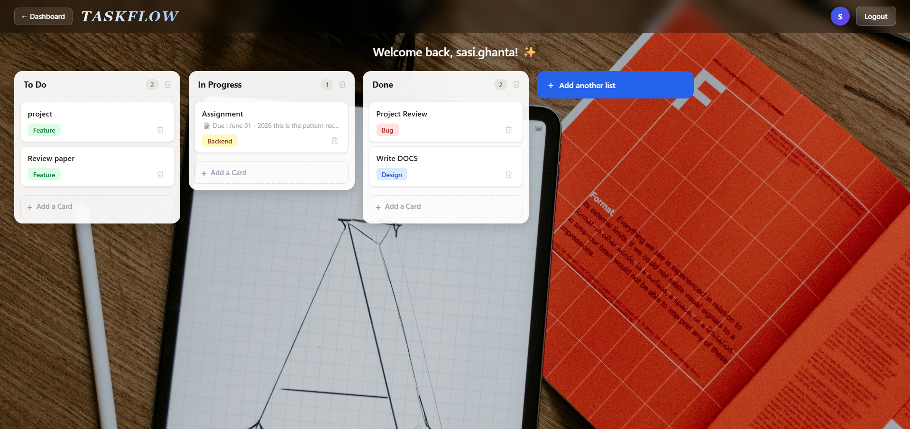

#  TaskFlow – Real-Time Collaborative Project Management Platform


A **modern Trello-inspired collaborative project management platform** built using a modern full-stack architecture powered by **React.js**, **Node.js**, **Express.js**, and **PostgreSQL (Supabase)** with **Socket.IO** and **JWT Authentication**.

TaskFlow enables teams to organize projects, manage tasks, collaborate in real-time, track project progress, and gain valuable insights through analytics and activity tracking.

 **Live Demo:** https://trello-tau-amber.vercel.app

 **Backend API:** https://trello-backend-i0lq.onrender.com

 **GitHub Repository:** https://github.com/sasighanta/TaskFlow

---

#  Features

##  Authentication

- User Registration
- Secure Login
- JWT Authentication
- Password Hashing using bcrypt
- Protected Routes
- Persistent User Sessions

---

##  Board Management

- Create Boards
- Rename Boards
- Delete Boards
- Multiple Boards per User
- Dashboard Overview
- Default Board Creation

---

##  List Management

- Create Lists
- Edit Lists
- Delete Lists
- Drag & Drop Lists
- Automatic Position Management

---

##  Card Management

- Create Cards
- Edit Card Details
- Delete Cards
- Drag & Drop Cards
- Move Cards Across Lists
- Rich Task Description
- Due Dates
- Priority Levels
- Labels
- Card Completion Status

---

##  Team Collaboration

- Workspace Management
- Shared Boards
- Invite Members
- Card Comments
- Activity Feed
- Notifications
- Real-Time Synchronization

---

##  Analytics Dashboard

- Total Tasks
- Completed Tasks
- Pending Tasks
- Weekly Activity
- Board Statistics
- Completion Percentage
- Priority Distribution
- Productivity Insights

---

##  Notifications

- Real-Time Notifications
- Activity Tracking
- User Action History
- Recent Activity Feed

---

##  Real-Time Features

- Socket.IO Integration
- Live Task Updates
- Instant Synchronization
- Real-Time Collaboration
- Auto Refresh Across Clients

---

##  Modern UI

- Responsive Design
- Interactive Dashboard
- Modern Card Layout
- Clean User Interface
- Mobile Friendly
- Professional Landing Page

---

#  Tech Stack

## Frontend

- React.js
- Vite
- JavaScript (ES6+)
- HTML5
- CSS3
- Axios
- Socket.IO Client

---

## Backend

- Node.js
- Express.js
- REST API
- JWT Authentication
- bcrypt
- Socket.IO

---

## Database

- PostgreSQL
- Supabase

---

#  Cloud & Deployment

## Frontend

- Vercel

## Backend

- Render

## Database

- Supabase PostgreSQL

---

#  REST API

| Method | Endpoint | Description |
|---------|----------|-------------|
| POST | `/api/register` | Register a New User |
| POST | `/api/login` | User Login |
| GET | `/api/user/:userId/boards` | Get User Boards |
| POST | `/api/boards` | Create Board |
| GET | `/api/board/:id` | Fetch Board Details |
| POST | `/api/lists` | Create List |
| PUT | `/api/lists/:id` | Update List |
| DELETE | `/api/lists/:id` | Delete List |
| POST | `/api/cards` | Create Card |
| PUT | `/api/cards/:id` | Update Card |
| DELETE | `/api/cards/:id` | Delete Card |
| GET | `/api/notifications/:userId` | Get Notifications |
| GET | `/api/boards/:boardId/analytics` | Board Analytics |

---

#  Project Structure

```text
TaskFlow
│
├── frontend
│   ├── public
│   ├── src
│   │   ├── assets
│   │   ├── components
│   │   ├── services
│   │   ├── App.jsx
│   │   └── main.jsx
│   ├── package.json
│   └── vite.config.js
│
├── backend
│   ├── attachments.routes.js
│   ├── auth.js
│   ├── boards.routes.js
│   ├── workspace.routes.js
│   ├── routes.js
│   ├── db.js
│   ├── index.js
│   ├── package.json
│   └── .env
│
└── README.md
```

---

#  Getting Started

## Clone the Repository

```bash
git clone https://github.com/sasighanta/TaskFlow.git
```

---

## Install Frontend

```bash
cd frontend

npm install

npm run dev
```

Frontend runs at:

```
http://localhost:5173
```

---

## Install Backend

```bash
cd backend

npm install

npm run dev
```

Backend runs at:

```
http://localhost:5000
```

---

#  Environment Variables

Create a `.env` file inside the backend folder.

```env
PORT=5000

DATABASE_URL=<your_postgresql_connection_string>

JWT_SECRET=<your_jwt_secret>

FRONTEND_URL=http://localhost:5173
```

---

#  Screenshots


## Login Page



---

## Dashboard



---

## Board




---

#  Roadmap

- AI Task Suggestions
- Email Notifications
- File Upload Support
- Team Roles & Permissions
- Dark / Light Theme
- Mobile Application
- Calendar Integrations
- Time Tracking
- Task Dependencies
- Advanced Reports
- AI Project Analytics

---

#  Key Highlights

- Full Stack Web Application
- JWT Authentication
- PostgreSQL Database
- RESTful API Architecture
- Real-Time Collaboration using Socket.IO
- Analytics Dashboard
- Activity Tracking
- Notification System
- Responsive UI
- Secure Authentication
- Professional Dashboard Design

---

#  Learning Outcomes

Through this project I gained practical experience in:

- Building scalable REST APIs with Express.js
- Implementing JWT Authentication
- Designing PostgreSQL databases
- Real-Time Communication using Socket.IO
- React State Management
- API Integration with Axios
- Full Stack Deployment
- Responsive UI Development
- Database Relationships
- Authentication & Authorization
- Deploying applications using Vercel and Render

---

#  Contributing

Contributions are welcome!

1. Fork the repository

2. Create a new branch

```bash
git checkout -b feature-name
```

3. Commit your changes

```bash
git commit -m "Add new feature"
```

4. Push to GitHub

```bash
git push origin feature-name
```

5. Open a Pull Request

---

#  License

This project is licensed under the **MIT License**.

---

#  Author

**Sasi Sai Tulasi Ghanta**

 Email: **sasighanta2006@gmail.com**

 LinkedIn  
https://www.linkedin.com/in/sasi-ghanta-04420a2b4

 GitHub  
https://github.com/sasighanta

 

---

